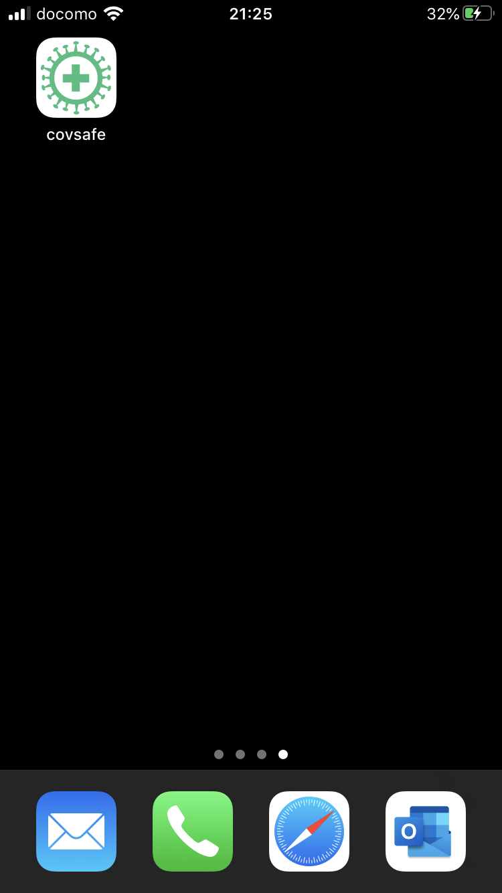
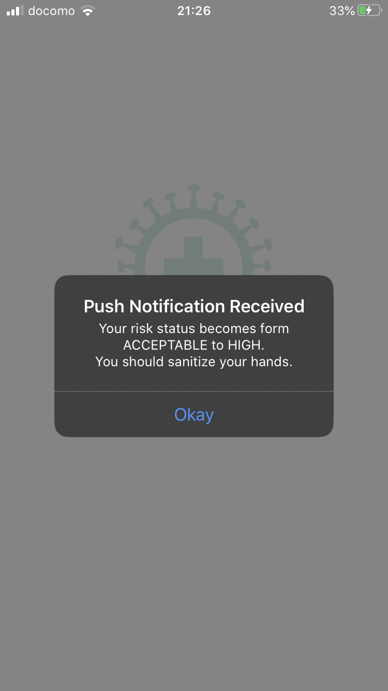
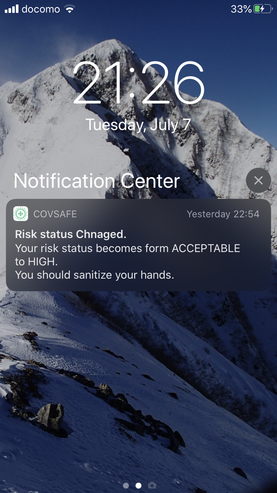
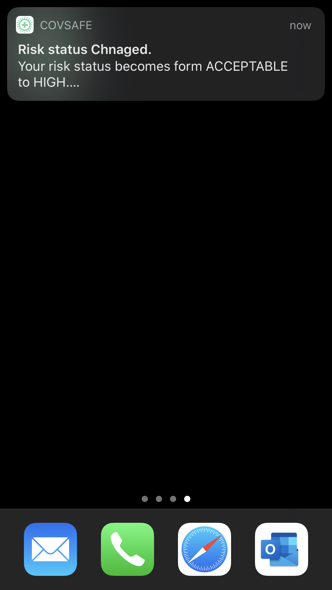

# Push Notifications

## DEMO
<table border="0" style="border-color:white">
<tr>
<td></td>
<td></td>
<td></td>
<td></td>
</tr>
</table>

## Features
- Send push notifications with the mobile push notification service, APNs. By this push notifications, it can be exchange the information in real time.

    - Notify event message to the indivisual by sending the push notification from backend service, called Risk Notifier, to the mobile phone app in order to control the indicator device of the shop officer.
    - Broadcast the messages from the backend service.

- Mobile can receive the push notifications without running the mobile app, as log as it's installed.

- The mobile app can receive push notifications when running in the background as well as when running in the foreground.

- Communications between back-end services and APNs, and between APNs and mobile phones are encrypted by TLS.
## Requirements
### Development Environment
- IBM Cloud
    - Push Notifications
    - Cloud Functions
    - Cloudant
- Xcode 11
- Apple Enterprise Developer Program

### Production Environment
- Mobile Phone
    - iOS only (Android is out of scope)
    - Install the mobile app
    - register the mobile phone device ID to the APNs.

## Installations and Configurations
- [STEP1](./docs/Installations.md): The step to setup and configure Push Notificatin related services
- STEP2: The step to create the action of IBM Cloud Functions, whitch can send the push notifications. See the Push notifications repository for specific instructions. 

## Usage
### Interface
- The action of IBM Cloud Functions

    |Parameter name|Description|Type|Mandatry/Optional|
    |---|---|---|---|
    | messageText|The body text of the push notifications|string|mandatry|
    | apnstitle |The title text of the push notifications|string|optional|
    | targetDeviceIds |The list of device ID of target mobile|string|optional|
    | apnsType | ['DEFAULT', 'MIXED', 'SILENT']|string|optional|

### Use Case
- [CASE1](./docs/usecase1.md): Send the push notification message to the indivisual mobile phone by specifying the device ID.
- [CASE2](./docs/usecase2.md): Send the push notification messages to all registered mobile phone devices.

## Author
 - Kentaro Watanabe

 
## Licence
- Apach2.0 License

