## Setup

### Reference

- Set up with the following URL as a reference.
    https://cloud.ibm.com/docs/solution-tutorials?topic=solution-tutorials-ios-mobile-push-analytics

### Advance Preparation
- Sign up for ADEP(Apple Developer Enterprise Program)
- Install Xcode
### IBM Cloud Portal : Building Mobile Apps from the Swift Starter Kit in the IBM Cloud app development dashboard.

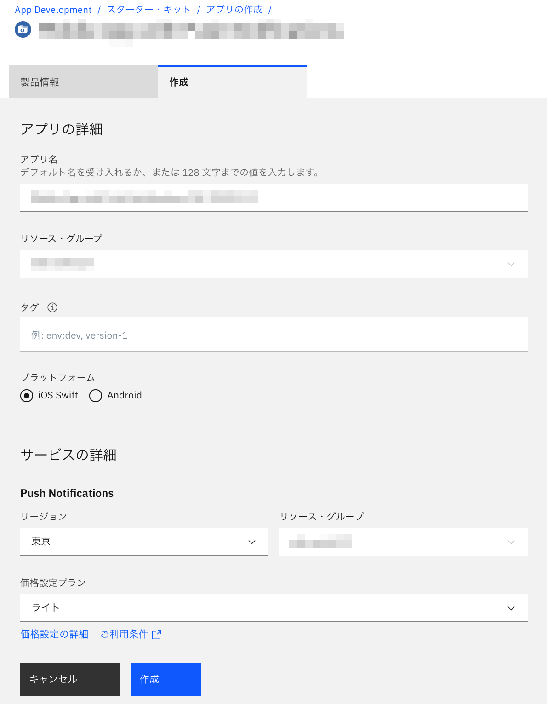

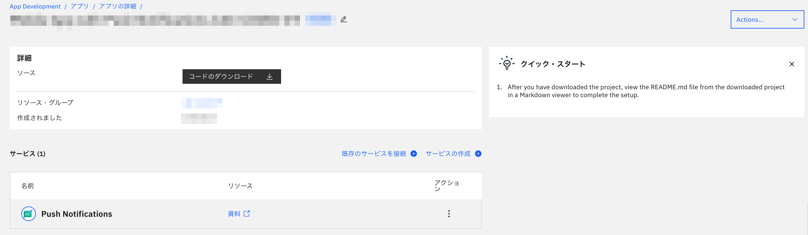

- Download the code. Setting up the client SDK

    ```
    $ sudo gem install cocoapods --pre
    $ unzip MobileAppwithPushNotificationsC4CCOVID19-Swift.zip
    $ cd MobileAppwithPushNotificationsC4CCOVID19-Swift
    $ pod install
    ```

### Apple Developer Portal:  Get APNs credentials and configure the Push Notifications service instance.

- Register App ID　

    　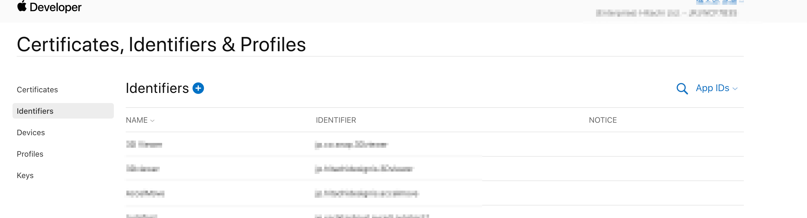

    - If you are in the Developer role, the registration button for the App ID doesn't appear. The Account Holder role is required.

    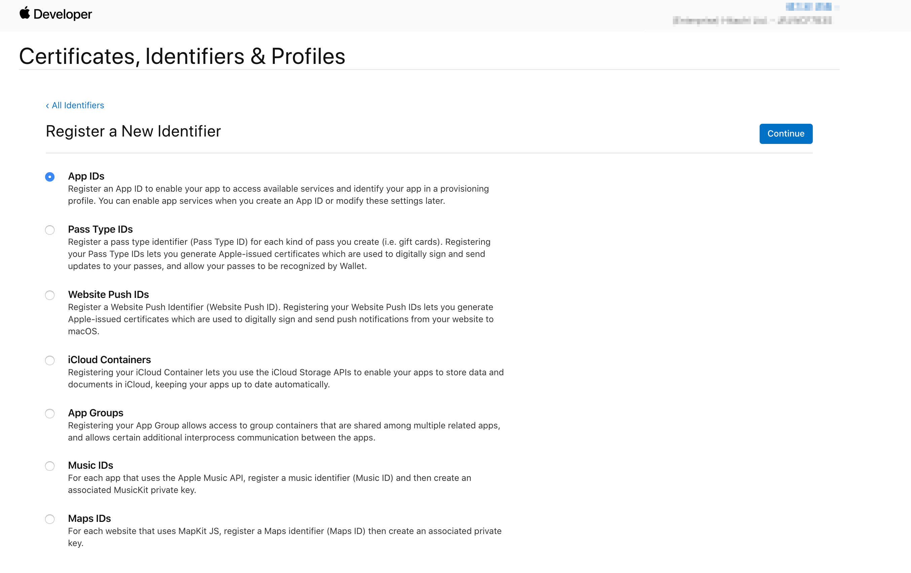

    

    - Specify Push Notifications for Capability.

        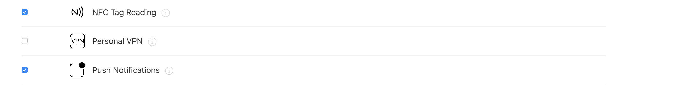

    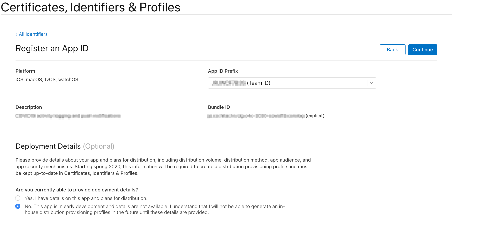

### Developper Client PC: Creating APNs SSL Certificates (one for development and one for distribution)

- Create Certificate Signing Request (CSR) in case your client is MacOSX

    - Launch Keychain Access in /Applications/Utilities.
    - Select Key Chain Access > Certificate Assistant > Request Certificate from Certificate Authority.
    - In the Certificate Assistant dialog, enter your email address in the User email address field.
    - Enter the name of the key in the "Common Name" field (e.g. Gita Kumar Dev Key).
    - Leave the "CA's email address" field blank.
    - Select 'Save to Disk' and click 'Continue'.

    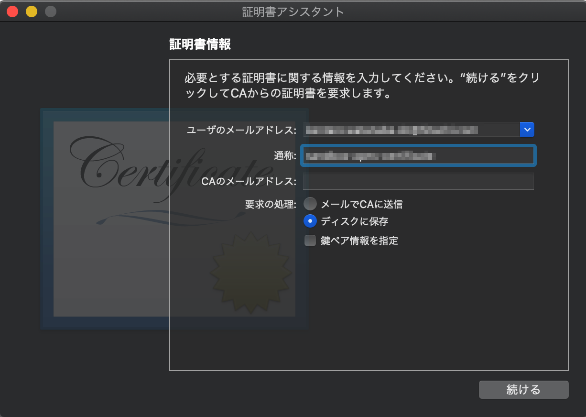

- Reference

    - https://help.apple.com/developer-account/#/devbfa00fef7

### Apple Developer Portal: Create a client SSL certificate


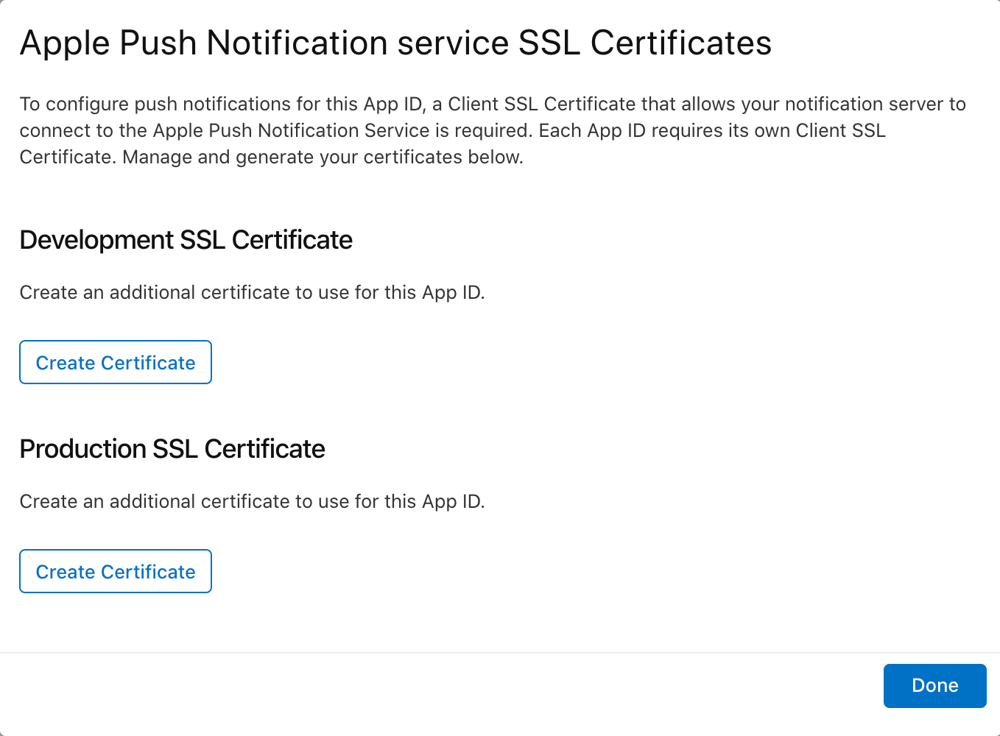

- Upload the CSR file

    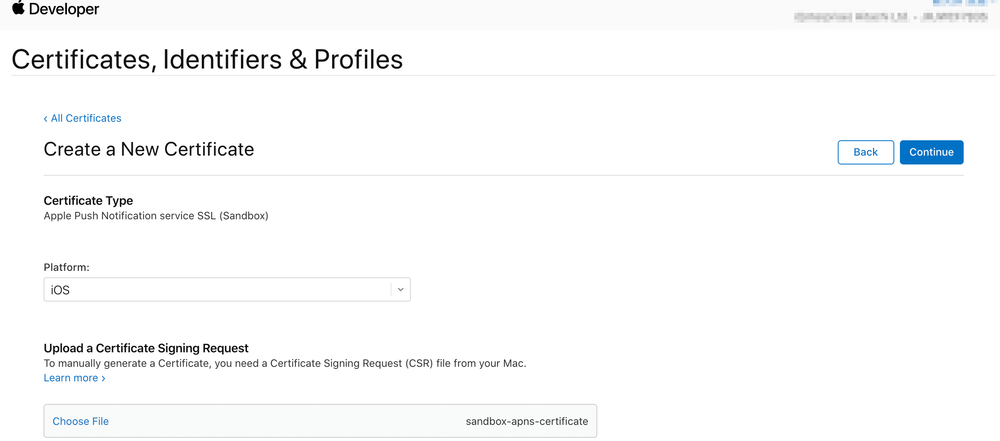

- Download the client certificate (.cer file)

    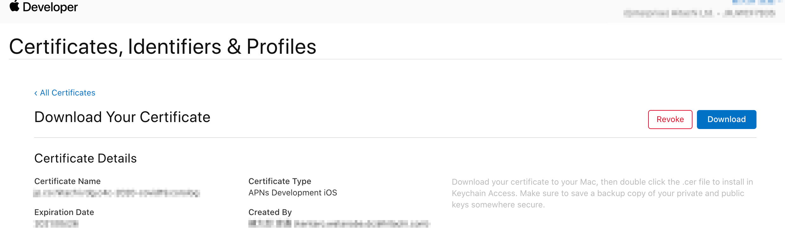

### Developer Client PC:  Create the Personal Information Exchange Format file.

- Import the client certificate (.cer file) and export in Personal Information Exchange Format (.p12 format) by Keychain Access.app on MacOSX
- Remember the password of .p12 format file.

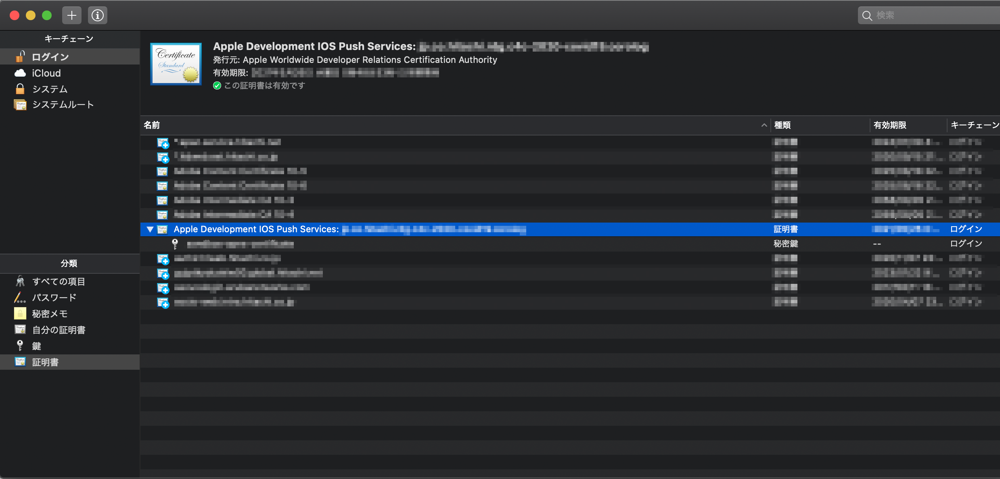

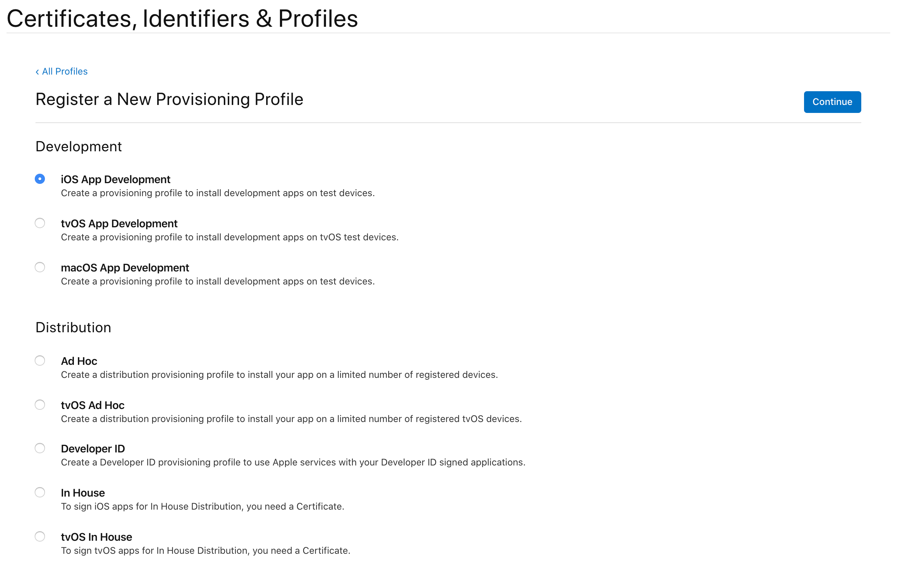

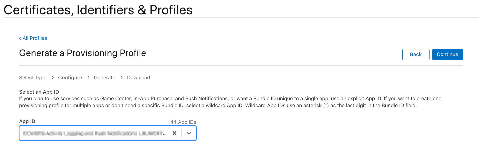

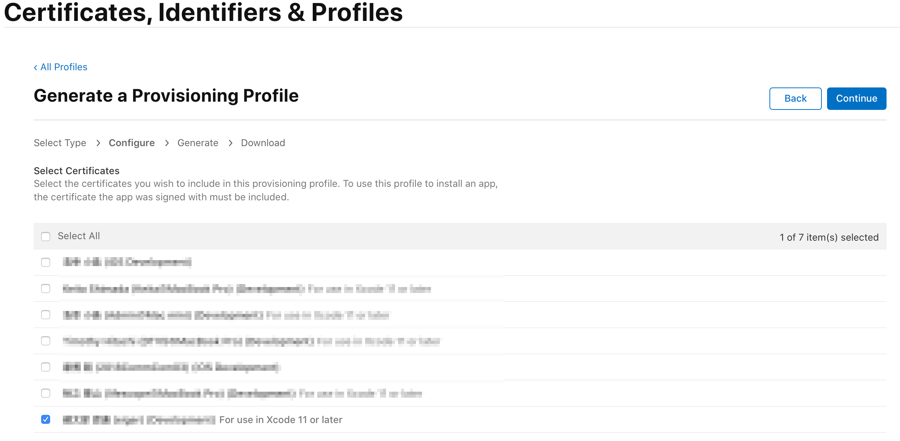

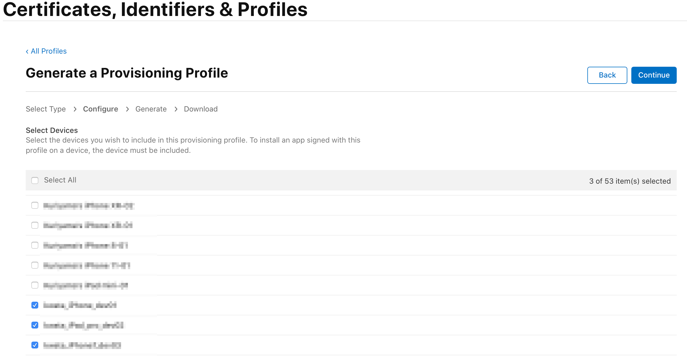

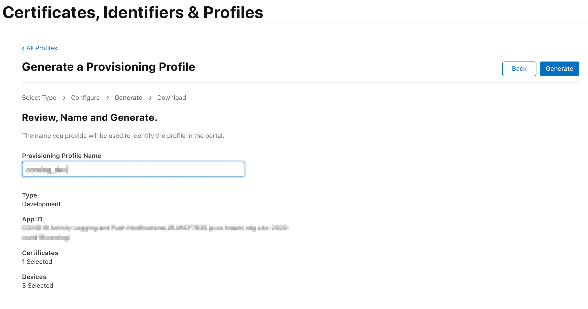

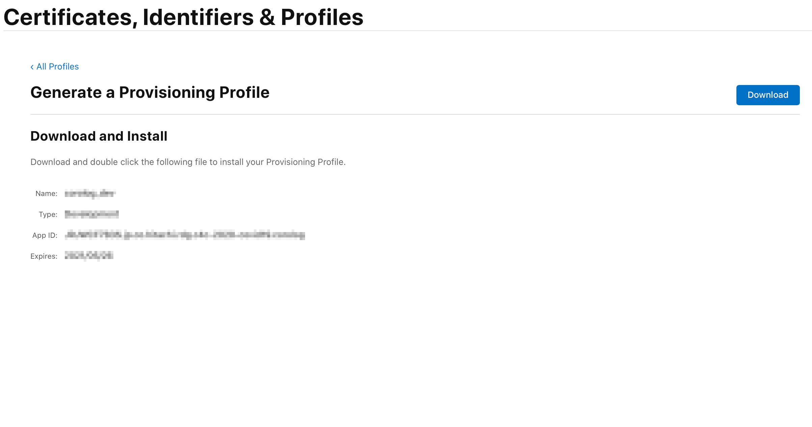

### IBM Cloud Portal: Configuration of Push Notifications Service Instance

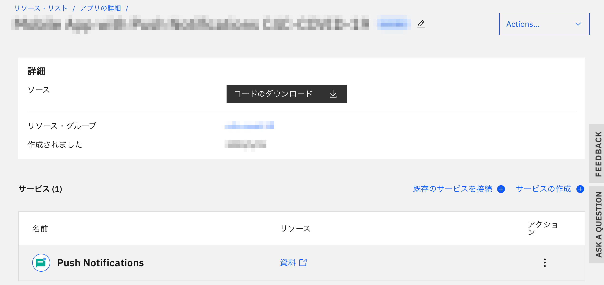


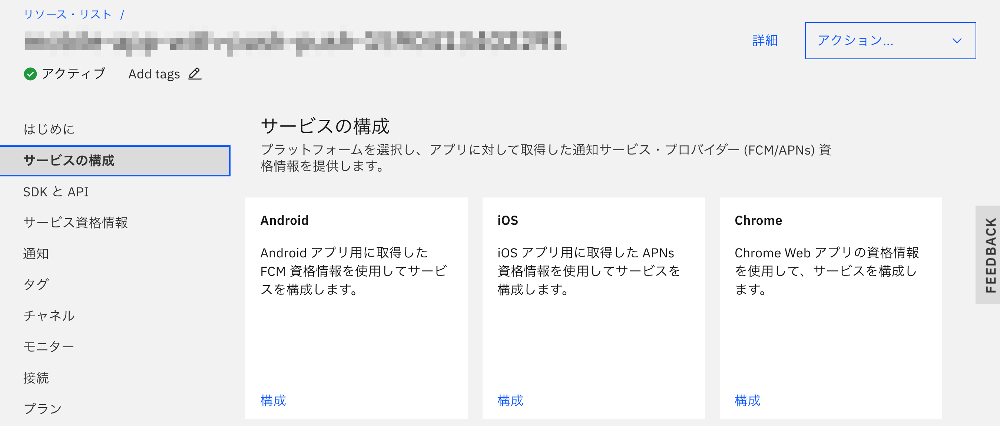

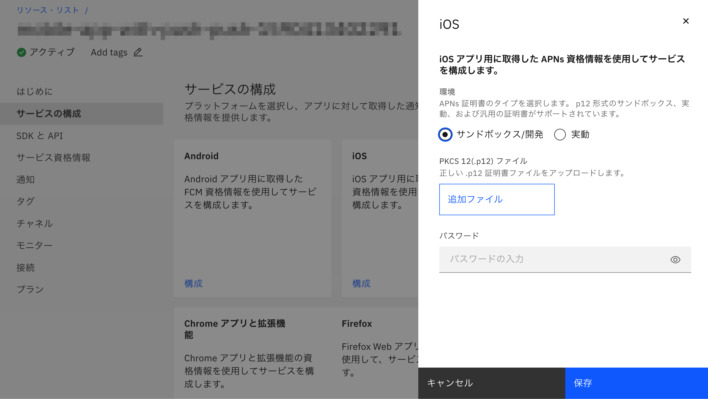

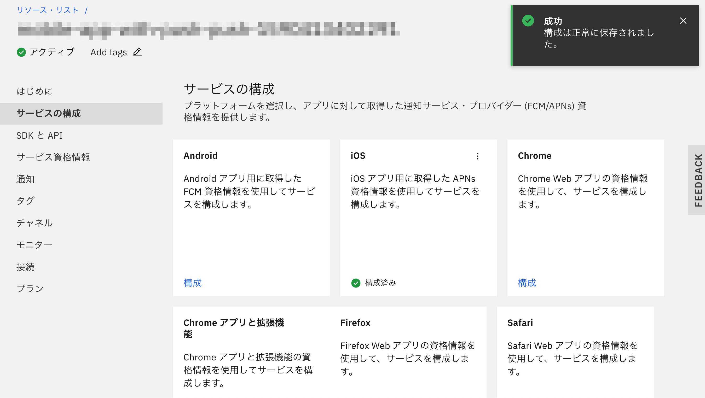

